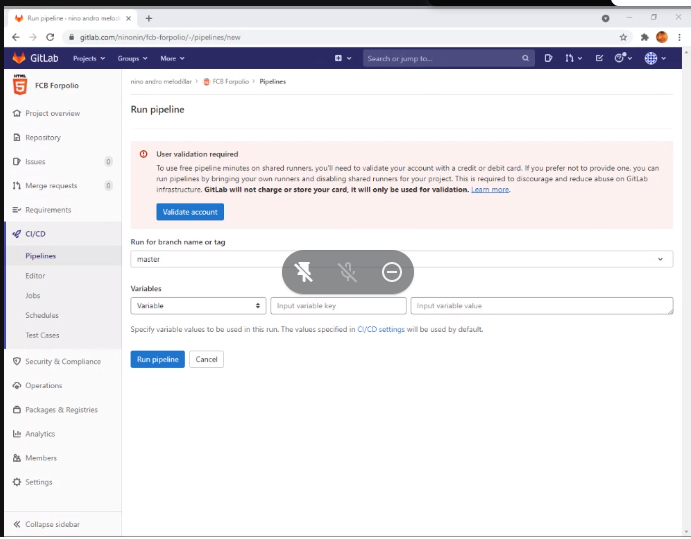
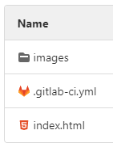
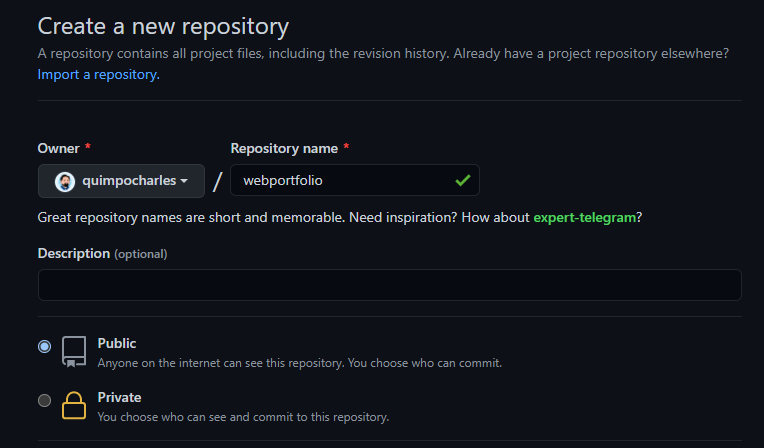
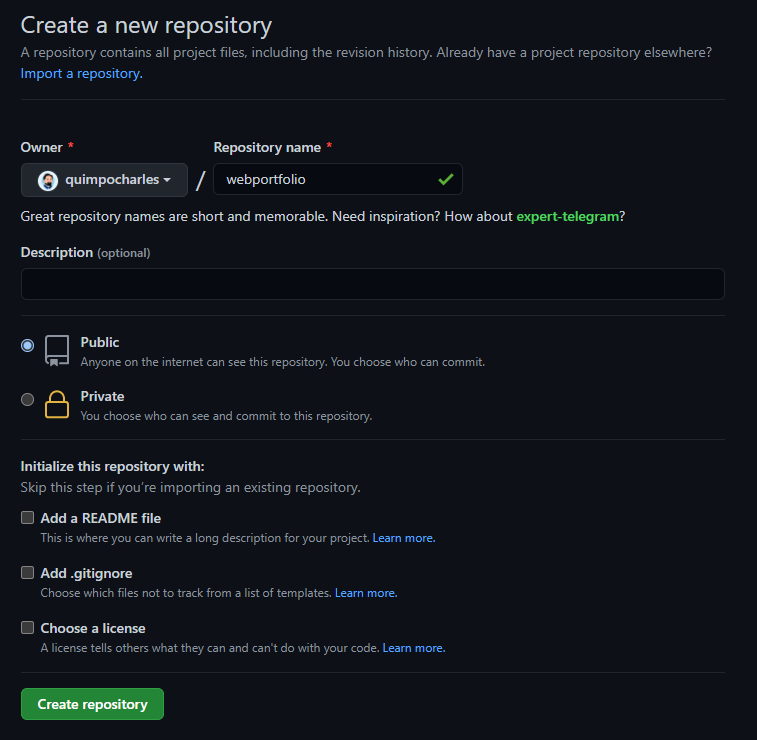
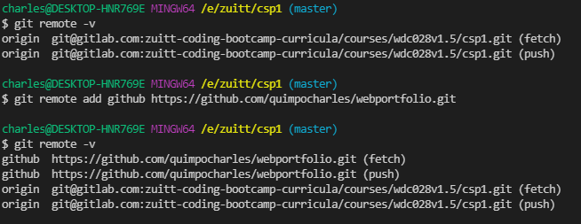
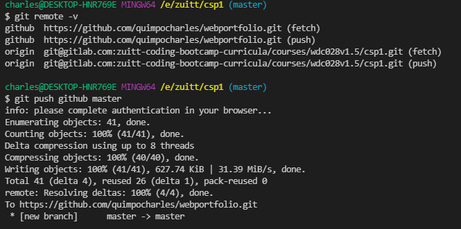
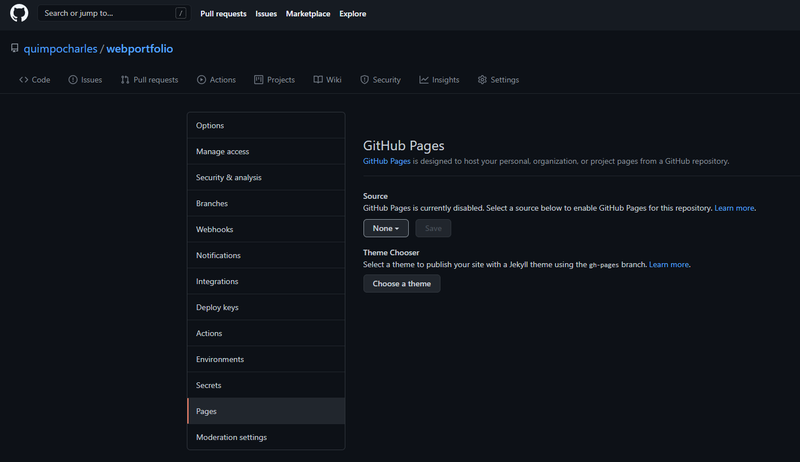
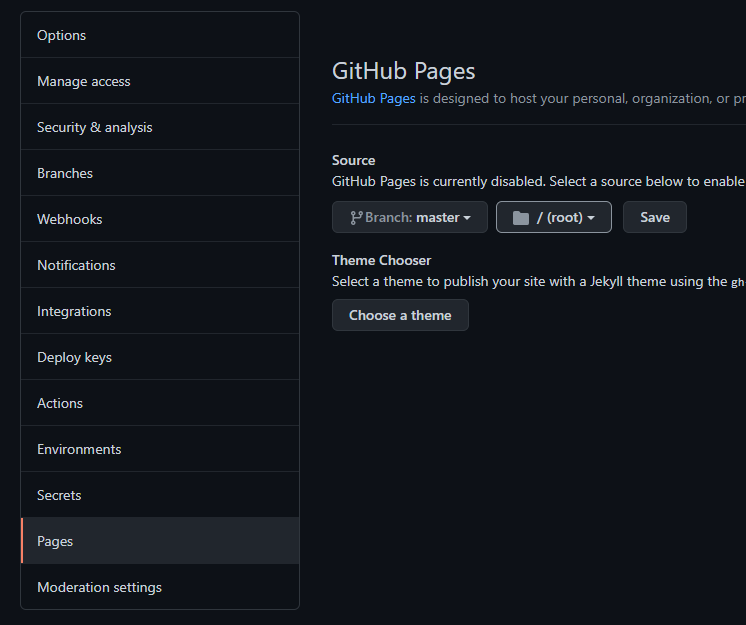

# Session Objectives

At the end of the session, the students are expected to:

- add styles and components to their developer portfolio web page as their 1st capstone project.

# Resources

## Instructional Materials

- [Google Slide Presentation](https://docs.google.com/presentation/d/1L6solhoi5BFAdsMwRxRg1ru_0e1RsWMXDEGgrIo-Ub4)
- [Sample CSP1 Project](https://zuitt-coding-bootcamp-curricula.gitlab.io/courses/wdc028v1.5/csp1/)
- [GitLab Repository](https://gitlab.com/zuitt-coding-bootcamp-curricula/courses/wdc028v1.5/csp1)

Hide the link of the sample from the students by setting the browser to full-screen so that they cannot visit the site themselves.

Alternatively, clone the sample project to your local machine and show the page.

# Capstone 1 Requirements

## Specific Requirements

- General Page Styles
  - Custom web page font style using [Google Fonts](https://fonts.google.com/).
  - Add text and background colors to give your web page more life.
- Project Section
  - Add a button anchor just below the paragraph in React Frontend (Ecommerce) column. The link will be added once you are finished with your CSP3.
- Contact Section
  - Add social media links (e.g. Facebook, LinkedIn).
- Page Responsiveness
  - The page should maintain its responsiveness on three types of devices (mobile, tablet and desktop).
- Personal GitLab Repository
  - The project must be created in your own GitLab account, not inside your own batch subgroup folder.

## Reminders

- All custom CSS code must be in an external CSS file.
- There should be no `<br>` elements in the source code.
- There should be no inline or internal CSS code.
- There should be no default web page fonts (Times New Roman).
- There should be no placeholder text in the page (like the Lorem Ipsum).
- There should be no horizontal scrolls when viewing the page.
- There should be no dead links.
- Do not create another website other than the required developer portfolio.
- Do not use templates found in other sites.

## Implementing GitLab Pages

**For batches experiencing the credit card verification issue in Gitlab Pages [https://about.gitlab.com/blog/2021/05/17/prevent-crypto-mining-abuse/]**



**Proceed to the Github Deployment section**

Put the information from this section to the Boodle notes of your batch or present these steps to the class.

1. In the root folder of the CSP1 project, add a file named `.gitlab-ci.yml`.
2. Inside the `.gitlab-ci.yml` file, add the following code:

   ```yaml
   pages:
     stage: deploy
     script:
       - mkdir .public
       - cp -r * .public
       - mv .public public
     artifacts:
       paths:
         - public
     only:
       - master
   ```

3. Once the code has been added, create a repository in your personal GitLab account (not in your student subgroup).
4. Push the project to that new personal repository.
5. The `.gitlab-ci.yml` must be found at the root directory of the project.

   

6. Immediately after pushing the changes, there should be a blue icon (in progress) in the right side of the latest commit information within the GitLab project.

   

   Once the process has finished running, it must show a green icon (success).

   

7. Inside the GitLab project, go to the **Settings > Pages** (found at the side navigation) to retrieve the link where the CSP1 project is being served.

   

## Github Deployment

**NOTE**  
This is the workaround used to solve the situation implemented by GitLab to require their new members to provide credit/debit card details to be able to run a pipeline -- in this case to deploy a static website using GitLab Pages.

1. Create a Github account [https://github.com/join]
1. Login to your Github account [https://github.com/login]
1. In your `Personal (Dashboard)`, click on the `Start a Project` button.
   
1. Add `webportfolio` as your repository name.
   
1. Set the visibility level for the repository to `Public`
   
1. Click on `Create Repository`
   
1. Copy the repository's `HTTPS URL`
   
   **Optional: Add an SSH Key for your Github Account [https://docs.github.com/en/github/authenticating-to-github/connecting-to-github-with-ssh/adding-a-new-ssh-key-to-your-github-account]**
1. Open your Terminal/Gitbash and go to your project folder
1. Run the command `git remote -v` to check the aliases and URLs associated with your local project.
   
1. Add the Github remote repository by executing the command `git remote add github <paste the url from the Github repository>`. This will add an alias called github to your local project which represents the URL to your Github repository.
   
1. Push the project to your github repository.
   
1. Go to the repository's `Settings Tab` and click on `Pages`
   
1. Select the `master branch as the Source` and `root` as your root folder.
   
1. Click on Save. Doing this will deploy the project and will create a new link.
   

# Instructor Notes

- Encourage students to ask questions.
